# 🚀 AI-Powered Job Finder

> **Find your perfect job match with AI-driven resume analysis and intelligent job recommendations**

An intelligent job search application that analyzes your resume using AI and finds the best matching job opportunities from multiple job boards. Get personalized job recommendations with match scores and direct apply links.

   

> **🌙 Dark Theme Edition!** - Stunning dark UI with glassmorphism effects, animated backgrounds, and glowing interactions

## ✨ Features

### 🤖 **AI-Powered Resume Analysis**
- Uses Google's Gemini AI to extract skills, experience, and relevant job titles from your resume
- Automatically determines your experience level (Entry, Junior, Mid, Senior, Lead)
- Generates personalized job search queries based on your background

### 🔍 **Multi-Platform Job Search**
- **LinkedIn Jobs**: Direct scraping for latest opportunities
- **Indeed**: Comprehensive job listings
- **Naukri.com**: India's leading job portal
- **JSearch API**: Access to multiple job boards (2,500+ free searches/month)

### 🎯 **Smart Job Matching**
- Advanced TF-IDF and cosine similarity algorithms
- Match scores from 0-100% based on resume relevance
- Experience-level filtering and bonus scoring
- Duplicate job removal across platforms

### 🔗 **Direct Apply Links**
- Automatically finds and provides direct application links
- Company career page discovery
- One-click apply functionality
- Multiple apply options per job

### 📅 **Advanced Filtering**
- Filter by posting date (24h, week, month, 3 months, all time)
- Location-based search
- Experience-level appropriate results
- Real-time job discovery

### 💾 **Job Management**
- Save interesting jobs for later
- Export job lists
- Track application status
- Persistent storage

### 🎨 **Modern Dark UI/UX**
- Stunning dark theme with glassmorphism effects
- Animated background particles and smooth transitions
- Glowing hover effects and interactive elements
- Fully responsive design (mobile-first)
- Enhanced accessibility with proper contrast
- Beautiful gradient buttons and cards

## 🎯 Benefits

### **For Job Seekers**
- ⏰ **Save Time**: No more manual searching across multiple job boards
- 🎯 **Better Matches**: AI finds jobs that actually match your skills
- 📊 **Clear Insights**: See exactly why each job matches your profile
- 🔗 **Easy Apply**: Direct links to application pages
- 📱 **Mobile Friendly**: Works perfectly on all devices

### **For Developers**
- 🆓 **Completely Free**: Uses free APIs and direct scraping
- 🔧 **Easy to Deploy**: One-click deployment on multiple platforms
- 🛠️ **Customizable**: Open source and easily extensible
- 📈 **Scalable**: Handles high traffic with efficient algorithms

### **Cost Savings**
- **$0/month**: No subscription fees or API costs
- **Unlimited Searches**: No daily or monthly limits
- **2,500+ API Calls**: Free tier from JSearch API
- **No Rate Limits**: Direct scraping with respectful delays

## 🚀 Quick Start Guide

### **Option 1: Run Locally (Recommended for Development)**

#### **Quick Setup (Automated)**
```bash
git clone https://github.com/yourusername/ai-job-finder.git
cd ai-job-finder
python setup.py
```

#### **Manual Setup**
1. **Clone the Repository**
   ```bash
   git clone https://github.com/yourusername/ai-job-finder.git
   cd ai-job-finder
   ```

2. **Install Dependencies**
   ```bash
   pip install -r requirements.txt
   ```

3. **Set Up Environment Variables**
   ```bash
   cp .env.example .env
   # Edit .env with your API keys
   ```

4. **Run Tests (Optional)**
   ```bash
   python final_test.py
   ```

5. **Run the Application**
   ```bash
   python app.py
   ```

6. **Access the App**
   Open your browser and go to `http://localhost:5000`

## 🔑 API Keys Setup

### **Google Gemini API (Required)**
1. Go to [Google AI Studio](https://makersuite.google.com/app/apikey)
2. Create a new API key
3. Add to your environment variables
4. **Free Tier**: 15 requests/minute, 1,500 requests/day

### **RapidAPI Key for JSearch (Optional but Recommended)**
1. Go to [RapidAPI JSearch](https://rapidapi.com/letscrape-6bRBa3QguO5/api/jsearch)
2. Subscribe to the free plan
3. Get your API key
4. **Free Tier**: 2,500 requests/month

## 📁 Project Structure

```
ai-job-finder/
├── 📄 app.py                          # Main Flask application
├── 📄 job_scraper_alternatives.py     # Job scraping engine
├── 📄 requirements.txt                # Python dependencies
├── 📄 Procfile                        # Deployment configuration
├── 📄 runtime.txt                     # Python version
├── 📄 final_test.py                   # Test suite
├── 📁 static/
│   ├── 🎨 style.css                   # Styling
│   └── ⚡ script.js                   # Frontend logic
├── 📁 templates/
│   └── 🌐 index.html                  # Main interface
└── 📄 README.md                       # This file
```

## 🔧 How It Works

```mermaid
graph TD
    A[📄 Upload Resume PDF] --> B[🤖 AI Analysis with Gemini]
    B --> C[📊 Extract Skills & Experience]
    C --> D[🔍 Generate Job Search Queries]
    D --> E[🌐 Multi-Platform Job Search]
    E --> F[📝 Collect Job Listings]
    F --> G[🎯 AI-Powered Job Matching]
    G --> H[📊 Calculate Match Scores]
    H --> I[🔗 Find Direct Apply Links]
    I --> J[📱 Display Results]
```



### **Detailed Process**

1. **📄 Resume Analysis**
   - PDF text extraction using PyPDF2
   - AI-powered skill and experience extraction
   - Experience level determination (Entry/Junior/Mid/Senior/Lead)

2. **🔍 Intelligent Job Search**
   - Multi-platform simultaneous searching
   - Experience-appropriate job filtering
   - Real-time duplicate removal

3. **🎯 Smart Matching Algorithm**
   - TF-IDF vectorization of resume and job descriptions
   - Cosine similarity calculation
   - Experience-level bonus scoring
   - Final match score (0-100%)

4. **🔗 Apply Link Discovery**
   - Company career page detection
   - Direct application link extraction
   - Multiple apply options per job

## 🧪 Testing

Run the comprehensive test suite:

```bash
python final_test.py
```

**Test Coverage:**
- ✅ Individual scraper functionality
- ✅ Job data cleaning and formatting
- ✅ AI-powered job matching
- ✅ Apply link generation
- ✅ Complete end-to-end workflow

## 🤝 Contributing

We welcome contributions! Here's how to get started:

1. **Fork the repository**
2. **Create a feature branch**
   ```bash
   git checkout -b feature/amazing-feature
   ```
3. **Make your changes**
4. **Add tests** for new functionality
5. **Submit a pull request**

### **Areas for Contribution**
- 🌐 Additional job board integrations
- 🎨 UI/UX improvements
- 🤖 Enhanced AI matching algorithms
- 🔧 Performance optimizations
- 📱 Mobile app development
- 🌍 Internationalization

## 📊 Performance & Limits

| Feature | Free Tier | Performance |
|---------|-----------|-------------|
| **Job Searches** | Unlimited | ~30 jobs/search |
| **Resume Analysis** | 1,500/day | ~2 seconds |
| **JSearch API** | 2,500/month | ~1 second |
| **Direct Scraping** | Unlimited | ~5 seconds |
| **Match Scoring** | Unlimited | ~1 second |

## 📄 License

This project is licensed under the MIT License - see the [LICENSE](LICENSE) file for details.

## 🆘 Support & Troubleshooting

### **Common Issues**

**❌ No jobs found**
- Check your API keys are correctly set
- Verify your resume has clear experience information
- Try different job titles in your resume

**❌ Low match scores**
- Ensure your resume has detailed job descriptions
- Include relevant technical skills
- Use industry-standard job titles

**❌ Missing apply links**
- Some job boards may block automated access
- Try refreshing or searching again
- Check if the company has a careers page

### **Getting Help**

1. 📖 Check this README for common solutions
2. 🐛 [Open an issue](https://github.com/yourusername/ai-job-finder/issues) on GitHub
3. 💬 Join our community discussions
4. 📧 Contact the maintainers

## 🌟 Star History

If this project helped you find your dream job, please give it a ⭐!

[](https://star-history.com/#yourusername/ai-job-finder&Date)

---

**Made with ❤️ by developers, for developers**

*Happy job hunting! 🎯* 